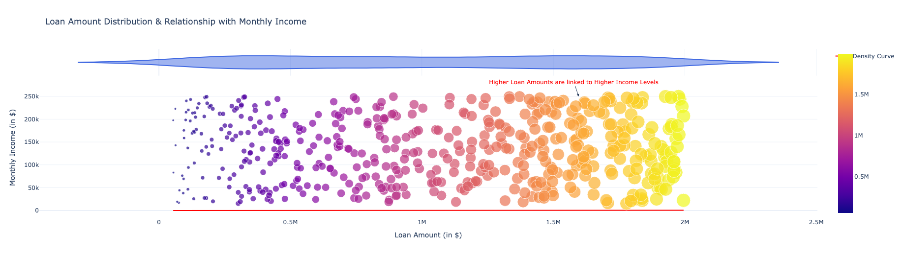
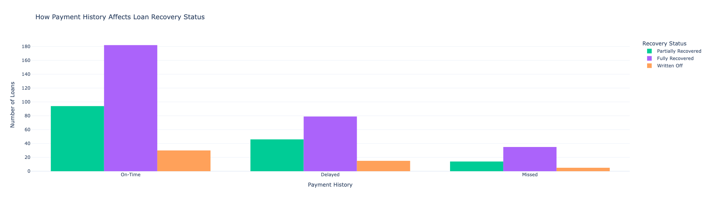
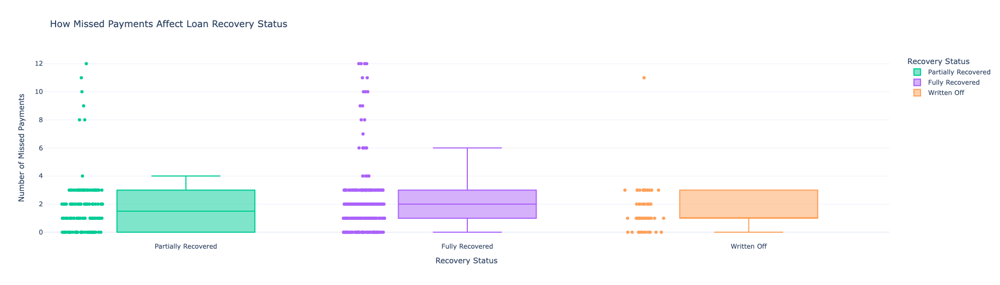
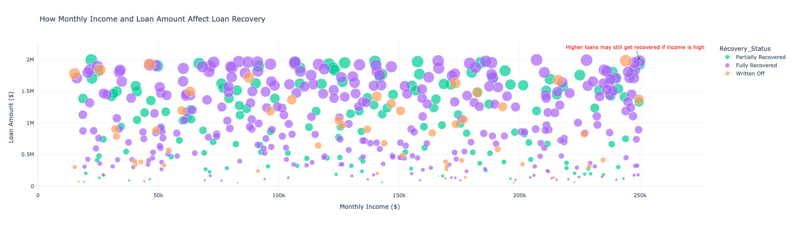
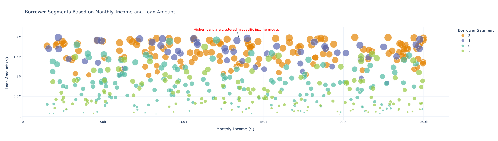
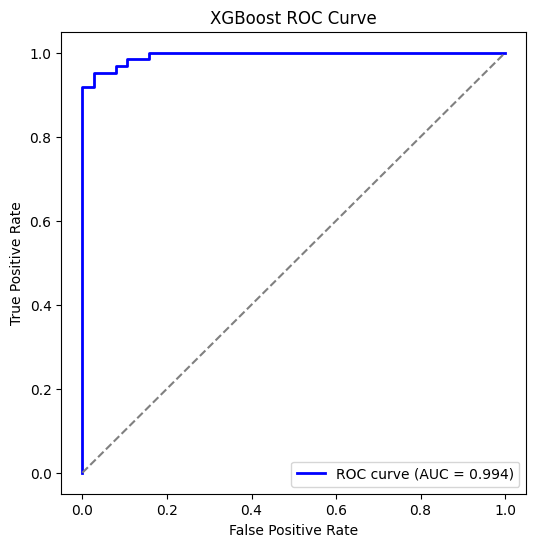
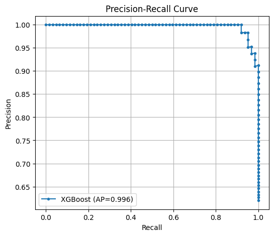

# Smart loan recovery 
This project focuses on predicting loan defaults and optimizing recovery strategies using machine learning. We analyze borrower profiles, identify high-risk segments, and build predictive models to estimate default probabilities. The goal is to support data-driven decision-making in loan recovery by combining statistical analysis, clustering, and classification models.


## The dataset for this project contains critical attributes such as: 
### 1. Demographic Information: Age, employment type, income level, and number of dependents.
### 2. Loan Details: Loan amount, tenure, interest rate, and collateral value.
### 3. Repayment History: Number of missed payments, days past due, and monthly EMI payments.
### 4. Collection Efforts: Collection methods used, number of recovery attempts, and legal actions taken.
### 5. Loan Recovery Status: Whether the loan was fully recovered, partially recovered, or remains outstanding.

 ### [Link to the dataset](https://amanxai.com/wp-content/uploads/2025/02/loan-recovery.csv)


## 1. Importing the dataset
```py
import pandas as pd
df = pd.read_csv("/content/loan recovery.csv")
print(df.head())
```
## 2. Let’s have a look at the summary statistics of the data
```py
df.describe()
```
## 3. Analyzing Data Distribution and Relationships
```py
import plotly.graph_objects as go
import plotly.express as px
import pandas as pd


fig = px.histogram(df, x='Loan_Amount', nbins=30, marginal="violin", opacity=0.7,
                   title="Loan Amount Distribution & Relationship with Monthly Income",
                   labels={'Loan_Amount': "Loan Amount (in $)", 'Monthly_Income': "Monthly Income"},
                   color_discrete_sequence=["royalblue"])

fig.add_trace(go.Scatter(
    x=sorted(df['Loan_Amount']),
    y=px.histogram(df, x='Loan_Amount', nbins=30, histnorm='probability density').data[0]['y'],
    mode='lines',
    name='Density Curve',
    line=dict(color='red', width=2)
))

scatter = px.scatter(df, x='Loan_Amount', y='Monthly_Income',
                     color='Loan_Amount', color_continuous_scale='Viridis',
                     size=df['Loan_Amount'], hover_name=df.index)

for trace in scatter.data:
    fig.add_trace(trace)

fig.update_layout(
    annotations=[
        dict(
            x=max(df['Loan_Amount']) * 0.8, y=max(df['Monthly_Income']),
            text="Higher Loan Amounts are linked to Higher Income Levels",
            showarrow=True,
            arrowhead=2,
            font=dict(size=12, color="red")
        )
    ],
    xaxis_title="Loan Amount (in $)",
    yaxis_title="Monthly Income (in $)",
    template="plotly_white",
    showlegend=True
)

fig.show()
```




### The visualization shows a clear positive correlation between monthly income and loan amount, suggesting that individuals with higher earnings typically obtain larger loans. The density curve at the top illustrates the spread of loan amounts, reinforcing that higher loan sizes are more common among higher-income groups. This pattern reflects the proportional link between income and loan size, indicating that loan approvals or customer profiling may be influenced by income levels.


## 4. Analyzing Payment History
```py
fig = px.histogram(df, x="Payment_History", color="Recovery_Status", barmode="group",
                   title="How Payment History Affects Loan Recovery Status",
                   labels={"Payment_History": "Payment History", "count": "Number of Loans"},
                   color_discrete_map={"Recovered": "green", "Not Recovered": "red"})

fig.update_layout(
    xaxis_title="Payment History",
    yaxis_title="Number of Loans",
    legend_title="Recovery Status",
    template="plotly_white",
        )

fig.show()
```



### Loans that are paid on time are generally recovered in full. In cases of delayed payments, recoveries vary between full, partial, and occasional write-offs. However, when payments are completely missed, the recovery rate drops sharply, with the majority of such loans being only partially recovered or written off entirely.

## 5. How Missed payments affect loan recovery status 

```py 
fig = px.box(df, x="Recovery_Status", y="Num_Missed_Payments",
             title="How Missed Payments Affect Loan Recovery Status",
             labels={"Recovery_Status": "Recovery Status", "Num_Missed_Payments": "Number of Missed Payments"},
             color="Recovery_Status",
             color_discrete_map={"Recovered": "green", "Not Recovered": "red"},
             points="all")

fig.update_layout(
    xaxis_title="Recovery Status",
    yaxis_title="Number of Missed Payments",
    template="plotly_white"
)

fig.show()
```


### Loans that are only partially recovered usually correspond to borrowers with up to four missed payments. Fully recovered loans are more often linked to fewer missed payments, typically between zero and two. In contrast, written-off loans are associated with a much higher number of missed payments, with many cases exceeding six. Overall, as missed payments increase, the probability of full recovery declines sharply, while the likelihood of write-offs rises significantly.


## 6. Analyzing Loan Recovery Based on Monthly Income

```py
fig = px.scatter(df, x='Monthly_Income', y='Loan_Amount',
                 color='Recovery_Status', size='Loan_Amount',
                 hover_data={'Monthly_Income': True, 'Loan_Amount': True, 'Recovery_Status': True},
                 title="How Monthly Income and Loan Amount Affect Loan Recovery",
                 labels={"Monthly_Income": "Monthly Income ($)", "Loan_Amount": "Loan Amount ($)"},
                 color_discrete_map={"Recovered": "green", "Not Recovered": "red"})

fig.add_annotation(
    x=max(df['Monthly_Income']), y=max(df['Loan_Amount']),
    text="Higher loans may still get recovered if income is high",
    showarrow=True,
    arrowhead=2,
    font=dict(size=12, color="red")
)

fig.update_layout(
    xaxis_title="Monthly Income ($)",
    yaxis_title="Loan Amount ($)",
    template="plotly_white"
)

fig.show()
```



### Individuals with higher incomes are more likely to achieve full loan recovery, even when borrowing larger amounts. In contrast, borrowers from lower income groups face a greater risk of partial recovery or loan write-offs. This pattern underscores the role of income in repayment outcomes, where higher earnings are linked to stronger repayment capacity and fewer defaults.

## Using K-Means clustering to create borrower segments based on monthly income and loan amount:
```py
from sklearn.cluster import KMeans
from sklearn.preprocessing import StandardScaler

features = ['Age', 'Monthly_Income', 'Loan_Amount', 'Loan_Tenure', 'Interest_Rate',
            'Collateral_Value', 'Outstanding_Loan_Amount', 'Monthly_EMI', 'Num_Missed_Payments', 'Days_Past_Due']

scaler = StandardScaler()
df_scaled = scaler.fit_transform(df[features])
```
```py
optimal_k = 4
kmeans = KMeans(n_clusters=optimal_k, random_state=42, n_init=10)
df['Borrower_Segment'] = kmeans.fit_predict(df_scaled)

fig = px.scatter(df, x='Monthly_Income', y='Loan_Amount',
                 color=df['Borrower_Segment'].astype(str), size='Loan_Amount',
                 hover_data={'Monthly_Income': True, 'Loan_Amount': True, 'Borrower_Segment': True},
                 title="Borrower Segments Based on Monthly Income and Loan Amount",
                 labels={"Monthly_Income": "Monthly Income ($)", "Loan_Amount": "Loan Amount ($)", "Borrower_Segment": "Segment"},
                 color_discrete_sequence=px.colors.qualitative.Vivid)

fig.add_annotation(
    x=df['Monthly_Income'].mean(), y=df['Loan_Amount'].max(),
    text="Higher loans are clustered in specific income groups",
    showarrow=True,
    arrowhead=2,
    font=dict(size=12, color="red")
)

fig.update_layout(
    xaxis_title="Monthly Income ($)",
    yaxis_title="Loan Amount ($)",
    template="plotly_white",
    legend_title="Borrower Segment"
)

fig.show()
```



### Borrowers in Segment 1 take on moderate to high loan amounts, suggesting relative financial stability. Segment 0 is concentrated among lower-income levels with moderate loan sizes, pointing to potential financial stress. Segment 2 is more evenly distributed, representing a balanced yet cautious borrower group. In contrast, Segment 3 is concentrated in high-loan, high-income ranges, signaling greater vulnerability to default despite higher earning capacity.

## Updating segment names
```py
df['Segment_Name'] = df['Borrower_Segment'].map({
    0: 'Moderate Income, High Loan Burden',
    1: 'High Income, Low Default Risk',
    2: 'Moderate Income, Medium Risk',
    3: 'High Loan, Higher Default Risk'
})
```
## Building an Early Detection System for Loan Defaults based on the Risk Scores
```py
from sklearn.ensemble import RandomForestClassifier
from sklearn.model_selection import train_test_split

df['High_Risk_Flag'] = df['Segment_Name'].apply(lambda x: 1 if x in ['High Loan, Higher Default Risk', 'Moderate Income, High Loan Burden'] else 0)

# selecting features for the model
features = ['Age', 'Monthly_Income', 'Loan_Amount', 'Loan_Tenure', 'Interest_Rate',
            'Collateral_Value', 'Outstanding_Loan_Amount', 'Monthly_EMI', 'Num_Missed_Payments', 'Days_Past_Due']
X = df[features]
y = df['High_Risk_Flag']

# splitting the data
X_train, X_test, y_train, y_test = train_test_split(X, y, test_size=0.2, random_state=42, stratify=y)


# training the model
rf_model = RandomForestClassifier(n_estimators=100, random_state=42)
rf_model.fit(X_train, y_train)

# get risk scores (probability of being high risk)
risk_scores = rf_model.predict_proba(X_test)[:, 1]  # probability of high risk

# add risk scores and flags to test data
df_test = X_test.copy()
df_test['Risk_Score'] = risk_scores
df_test['Predicted_High_Risk'] = (df_test['Risk_Score'] > 0.5).astype(int)  # Threshold at 50% probability

# merging with borrower details
df_test = df_test.merge(df[['Borrower_ID', 'Segment_Name', 'Recovery_Status', 'Collection_Method', 'Collection_Attempts', 'Legal_Action_Taken']],
                        left_index=True, right_index=True)
```

### We began by tagging borrowers as high-risk according to their segment classification. Next, a set of key financial and behavioral variables was selected to train a Random Forest Classifier. The dataset was divided into training and testing subsets, and the model was trained to estimate the probability of borrower default. Using the test data, we generated risk scores and categorized borrowers as either high-risk or low-risk based on a chosen probability cutoff. Finally, these predictions were combined with borrower profiles to support data-driven recovery strategies.

##  Dynamic recovery strategy based on Risk Scores
```py
# creating a new column for the dynamic recovery strategy based on risk scores
def assign_recovery_strategy(risk_score):
    if risk_score > 0.75:
        return "Immediate legal notices & aggressive recovery attempts"
    elif 0.50 <= risk_score <= 0.75:
        return "Settlement offers & repayment plans"
    else:
        return "Automated reminders & monitoring"

df_test['Recovery_Strategy'] = df_test['Risk_Score'].apply(assign_recovery_strategy)

df_test.head()
```

## XGBoost Model Performance

```py
import xgboost as xgb
xgb_model = xgb.XGBClassifier(n_estimators=100, random_state=42)
xgb_model.fit(X_train, y_train)
xgb_accuracy = accuracy_score(y_test, xgb_model.predict(X_test))
print("Random Forest Accuracy:", accuracy)
print("XGBoost Accuracy:", xgb_accuracy)
```
### Random Forest Accuracy: 0.92
### XGBoost Accuracy: 0.94


```py
from sklearn.metrics import accuracy_score, precision_score, recall_score, f1_score, roc_auc_score

# Predict class labels
y_pred = xgb_model.predict(X_test)

# Predict probabilities for ROC-AUC and threshold-based metrics
y_prob = xgb_model.predict_proba(X_test)[:, 1]

# Calculate metrics
accuracy = accuracy_score(y_test, y_pred)
precision = precision_score(y_test, y_pred)
recall = recall_score(y_test, y_pred)
f1 = f1_score(y_test, y_pred)
roc_auc = roc_auc_score(y_test, y_prob)

print(f"Accuracy: {accuracy:.4f}")
print(f"Precision: {precision:.4f}")
print(f"Recall: {recall:.4f}")
print(f"F1 Score: {f1:.4f}")
print(f"ROC-AUC: {roc_auc:.4f}")

```

### Evaluation Metrics
### Accuracy: 94.0%
### Precision: 98.3%
### Recall: 91.9%
### F1-Score: 95.0%
### ROC-AUC: 0.994
### These results show that the XGBoost classifier is highly effective at distinguishing between high-risk and low-risk borrowers, with particularly strong precision (minimizing false positives) and a near-perfect ROC-AUC score.


## ROC Curve Analysis
```py 
import matplotlib.pyplot as plt
from sklearn.metrics import roc_curve, auc

# Get false positive rate, true positive rate
fpr, tpr, thresholds = roc_curve(y_test, y_prob)
roc_auc = auc(fpr, tpr)

plt.figure(figsize=(6,6))
plt.plot(fpr, tpr, color='blue', lw=2, label=f'ROC curve (AUC = {roc_auc:.3f})')
plt.plot([0, 1], [0, 1], color='gray', linestyle='--')  # random guess line
plt.xlabel("False Positive Rate")
plt.ylabel("True Positive Rate")
plt.title("XGBoost ROC Curve")
plt.legend(loc="lower right")
plt.show()
```

### The ROC curve illustrates the trade-off between the True Positive Rate and the False Positive Rate across different classification thresholds.
### The curve is very close to the top-left corner, indicating excellent model performance.
### An AUC (Area Under Curve) of 0.994 suggests near-perfect discrimination, meaning the model is highly reliable in predicting loan default risk.
### Compared to the Random Forest model (92% accuracy), XGBoost achieves higher accuracy and a superior balance between recall and precision, making it better suited for borrower risk classification.




## Precision-Recall Curve for XGBoost 
```py
import matplotlib.pyplot as plt
from sklearn.metrics import precision_recall_curve, average_precision_score

precision, recall, thresholds = precision_recall_curve(y_test, y_proba)
ap_score = average_precision_score(y_test, y_proba)

plt.figure(figsize=(6,5))
plt.plot(recall, precision, marker='.', label=f'XGBoost (AP={ap_score:.3f})')
plt.xlabel('Recall')
plt.ylabel('Precision')
plt.title('Precision-Recall Curve')
plt.legend()
plt.grid()
plt.show()
```




### The curve stays close to 1.0 precision across most recall values, meaning the model rarely misclassifies low-risk borrowers as high-risk. The Average Precision (AP) score = 0.996, indicating near-perfect classification capability. This demonstrates that the XGBoost model is highly effective for imbalanced loan default prediction, where correctly identifying high-risk borrowers is critical.

## Random Forest vs. XGBoost
### Random Forest
### Achieved 92% accuracy, with balanced precision and recall.
### Performs reliably and is less sensitive to parameter tuning.
### A good choice when you need a quick, interpretable, and stable model with less risk of overfitting.

## XGBoost
###  Delivered 94% accuracy, higher precision (0.98), and a near-perfect ROC-AUC (0.994) and AP (0.996).
### Excels in detecting high-risk borrowers while minimizing false positives.
### Works best when you need a high-performance model for complex datasets and can afford additional computation and tuning effort.

## When to Use Which
## Use Random Forest if you want a simpler, easier-to-train model that still gives strong results without heavy tuning.
## Use XGBoost when predictive performance is critical, especially for imbalanced problems like loan defaults, where correctly identifying high-risk borrowers is more important than training speed.
